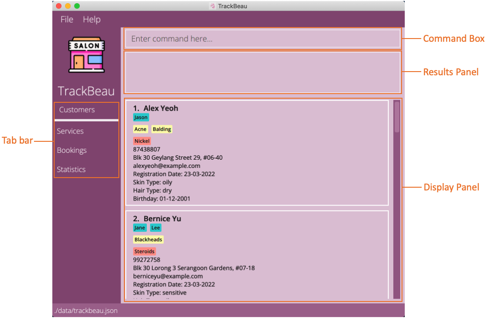
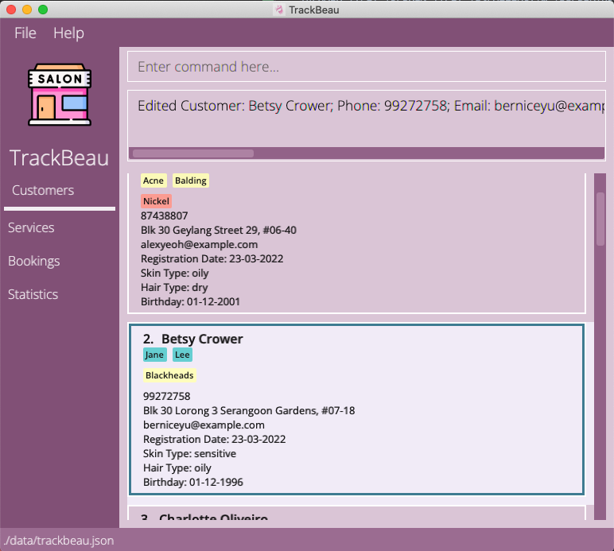
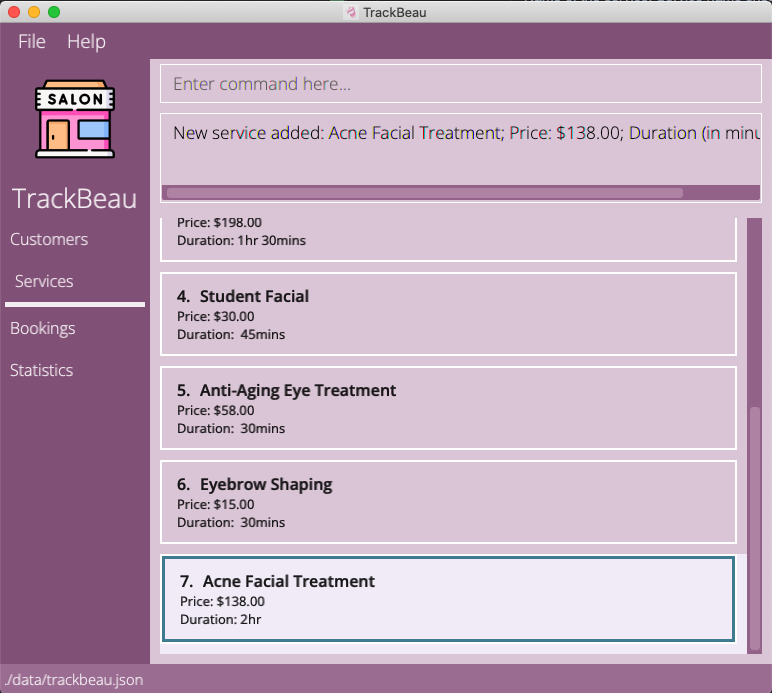
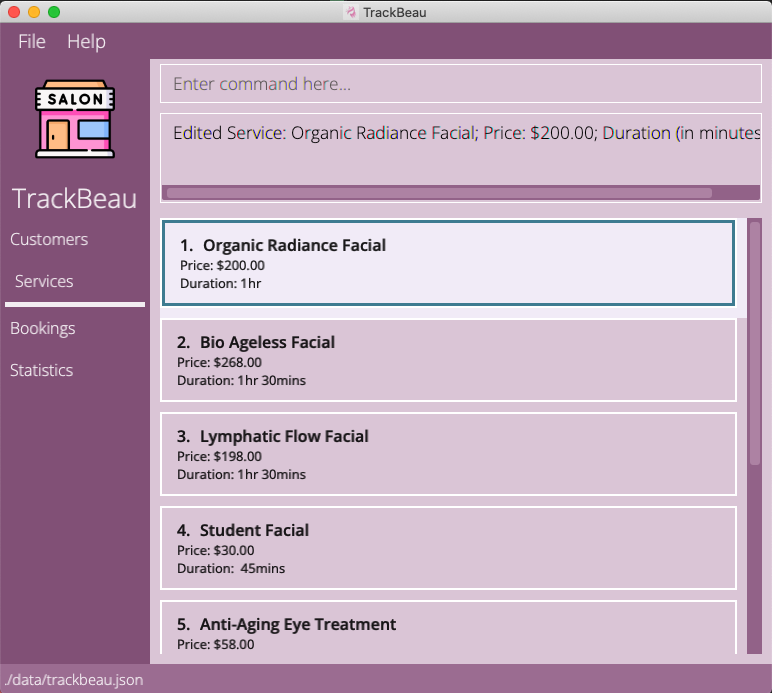

* Table of Contents
{:toc}

--------------------------------------------------------------------------------------------------------------------

## 1. Introduction

TrackBeau is a **desktop app made for beauty salons to aid them in managing customers' profile, bookings and services.
It is optimized for use via a Command Line Interface** (CLI) while still having the benefits of a Graphical User
Interface (GUI). If you can type fast, TrackBeau can help you manage your customers, bookings and services faster than
traditional GUI apps.

--------------------------------------------------------------------------------------------------------------------

## 2. Quick start

1. Ensure you have Java `11` or above installed in your Computer.

2. Download the latest `trackbeau.jar` from [here](https://github.com/AY2122S2-CS2103-F11-3/tp/releases).

3. Copy the file to the folder you want to use as the _home folder_ for your TrackBeau.

4. Double-click the file to start the app. The GUI similar to the below should appear in a few seconds. Note how the app contains some sample data. 
   

5. Type the command in the command box and press Enter to execute it. E.g., typing **`listc`** and pressing Enter will show you profiles of all customers. 
   Some example commands you can try:

   * **`lists`** : Shows a list of all services in the application.
   * **`help`** : Opens the help window.
   * **`exit`** : Exits the app.

6. Refer to the [4. Features](#4.-features) below for details of each command.

--------------------------------------------------------------------------------------------------------------------

## 3. About

### 3.1 Structure of this document

This User Guide is structured in a way that lets you find what you need quickly and easily.
You can jump to the different sections easily by referring to the Table of Contents.
In the following subsection, [3.2 Reading this document](#32-reading-this-document), you can find several tips on how to read this guide.
The next section, [4. Features](#4-features) documents the main features in TrackBeau and provides you with 
instructions on how to use them.

### 3.2 Reading this document
This subsection introduces you to the symbols, syntax and technical terms that are used throughout this guide.
Getting yourself familiar with this subsection is useful in helping you to better understand this guide.

#### 3.2.1 Symbols and syntax
The table below explains the symbols and syntax used throughout the user guide.

| Symbol/Syntax    | Meaning                                                                                        |
|----------------- |------------------------------------------------------------------------------------------------|
|
Information: Example information
| Text that appears in the information box indicates additional information that may be useful to know.|
|
:bulb: **Tip:** Example tip
| Text that appears in the tip box are useful for enhancing your experience with using TrackBeau.|                                               
|
:exclamation: **Caution:** Example warning
| Text that appears in the caution box is important as unwanted consequences might arise if not followed.|

#### 3.2.2 Sections of TrackBeau's GUI
The image below shows the annotated GUI components of TrackBeau.

#### 3.2.3 Navigating in TrackBeau
TrackBeau consists of tabs that are toggleable in the tab bar on the left side of the GUI.
By selecting a tab, it toggles the display panel to showcase the contents related to the tab e.g., by clicking on
Services, it will display a list of services available. By default, the Customers tab is selected.

There is also a menu bar at the top of the GUI that consists of 2 menu item, File and Help. By clicking on File,
you will be able to access Exit to exit the app. By clicking on Help, you will be able to access Help F1 to open the help window.

You can enter the commands via the command box and pressing Enter to execute them.
The results panel will then display a response on whether the command was successfully executed.
The display panel will then automatically refresh to display the contents of the results of the command executed. 

#### 3.2.4 Command Format
The table below explains the important technical terms to help you understand how to use the commands in TrackBeau.

| Technical Term | Meaning              | 
|----------------|----------------------|
|Command Word    | The first word of the command determines the action that TrackBeau should perform.|
|Prefix          | The characters right before each parameter which distinguishes one parameter from the other.|
|Parameter       | The words right after the prefix. Each parameter is a value given to the command to perform the specified action.|

**Example**:
* `addc n/NAME p/PHONE a/ADDRESS e/EMAIL`
* Command Word: `addc`
* Prefixes: `n/`, `p/`, `a/`, `e/`
* Parameters: `NAME`, `PHONE`, `ADDRESS`, `EMAIL`

The commands in TrackBeau follows these rules:
* Words in `UPPER_CASE` are the parameters to be supplied by you. 
  e.g., in `add n/NAME`, `NAME` is a parameter which can be used as `add n/John Doe`.

* Items in square brackets are optional. 
  e.g., `n/NAME [e/EMAIL]` can be used as `n/John Doe e/johnd@example.com` or as `n/John Doe`.

* Items with `…`​ after them can be used multiple times including zero times. 
  e.g., `[sep/SERVICE_PREFERENCE]…​` can be used as ` ` (i.e., 0 times), `sep/massage`, `sep/facial sep/massage` etc.

* Parameters can be in any order. 
  e.g., if the command specifies `n/NAME p/PHONE_NUMBER`, `p/PHONE_NUMBER n/NAME` is also acceptable.

* If a parameter is expected only once in the command, but you specified it multiple times, only the last occurrence of the parameter will be taken. 
  e.g., if you specify `p/12341234 p/56785678`, only `p/56785678` will be taken.

* Extraneous parameters for commands that do not take in parameters (such as `listc`, `exit`) will be ignored. 
  e.g., if the command specifies `listc 123`, it will be interpreted as `listc`.
  
--------------------------------------------------------------------------------------------------------------------

## 4. Features
This section contains the information about the features and commands of TrackBeau. 
It is split into the following subsections:
1. [Customer management ](#41-customer-management)
2. [Service management ](#42-service-management)
3. [Booking management ](#43-booking-management)
4. [Statistics ](#44-statistics)
5. [Miscellaneous ](#45-miscellaneous)

### 4.1 Customer management

#### 4.1.1 Customer management command parameters
The table below shows a list of command parameters that will be used for customer management.

|Parameter|Description|
|---------|-----------|
|`NAME`|Name of the customer. Names should only contain alphanumeric characters and spaces, and it should not be blank.|
|`PHONE_NUMBER`|Phone number of the customer. Phone numbers should only contain numbers, and it should be at least 3 digits long.|
|`ADDRESS`|Address of the customer. Addresses can take any values, and it should not be blank.|
|`EMAIL`|Email of the customer. Emails should be of the format local-part@domain and adhere to the following constraints:   <ol><li> The local-part should only contain alphanumeric characters and these special characters, excluding the parentheses, (+_.-). The local-part may not start or end with any special characters.</li> <li> This is followed by a '@' and then a domain name. The domain name is made up of domain labels separated by periods. The domain name must: <ul><li>end with a domain label at least 2 characters long</li> <li>have each domain label start and end with alphanumeric characters</li> <li>have each domain label consist of alphanumeric characters, separated only by hyphens, if any.</li><ul></li></ol>|
|`STAFF_PREFERENCE`|The name of the staffs that the customer prefers. Staffs' name can be any values, and it should not be blank.|
|`SERVICE_PREFERENCE`|The name of the services that the customer prefers. Services' name can be any values, and it should not be blank.|
|`HAIR_TYPE`|The hair type of the customer. Hair types can be any values, and it should not be blank.|
|`SKIN_TYPE`|The skin type of the customer. Skin types can be any values, and it should not be blank.|
|`ALLERGY`|The allergy that the customer has. Allergies can be any values, and it should not be blank.|
|`BIRTHDATE`|The birthdate of the customer. Birthdate should follow dd-MM-yyyy and be valid date.|
|`REGISTRATION_DATE`|The registration date of the customer. Registration date should follow dd-MM-yyyy and be valid date.|
|`INDEX`|The index of the customer in the displayed list. It must be a valid positive index.|

#### 4.1.2 Adding a customer: `addc`

Adds a customer to the application.

Format: `addc n/NAME p/PHONE_NUMBER a/ADDRESS [e/EMAIL] [stp/STAFF_PREFERENCE]…​ [sep/SERVICE_PREFERENCE]…​ [h/HAIR_TYPE] [s/SKIN_TYPE] [al/ALLERGY]…​ [bd/BIRTHDATE] [rd/REGISTRATION_DATE]`

:bulb: **Tip:**
A customer can have any number of preferred staffs, preferred services and allergies (including 0)

Examples:
* `addc n/John Doe p/98765432 a/John street, block 123, #01-01 e/johnd@example.com`
* `addc n/Betsy Crowe e/betsycrowe@example.com a/Newgate Prison p/1234567 al/Aloe Vera sep/facial sep/massage`

#### 4.1.3 Listing all customers : `listc`

Shows a list of all customers in the application.

Format: `listc`

#### 4.1.4 Editing a customer : `editc`

Edits an existing customer in the application.

Format: `editc INDEX [n/NAME] [p/PHONE_NUMBER] [a/ADDRESS] [e/EMAIL] [stp/STAFF_PREFERENCE]…​ [sep/SERVICE_PREFERENCE]…​ [h/HAIR_TYPE] [s/SKIN_TYPE] [al/ALLERGY]…​ [bd/BIRTHDATE] [rd/REGISTRATION_DATE]`

Information: 
<ul>
    <li>At least one of the optional fields must be provided.</li>
    <li>Existing values will be updated to the input values.</li>
</ul>

:exclamation: **Caution:**
<ul>
    <li>When editing staff/service preferences or allergies, the existing staff/service preferences or allergies will be removed i.e., adding of staff/service preferences or allergies is not cumulative.</li>
    <li>By leaving the staff/service preferences or allergies parameter empty, i.e, `stp/` or `sep/` or `al/` it will remove all the staff/service preferences or allergies currently associated with the customer.</li>
</ul>

Examples:
*  `editc 1 p/91234567 e/johndoe@example.com` Edits the phone number and email address of the 1st customer to be `91234567` and `johndoe@example.com` respectively.
*  `editc 2 n/Betsy Crower al/` Edits the name of the 2nd customer to be `Betsy Crower` and removes all existing allergies.

Example Usage: `editc 2 n/Betsy Crower al/`

#### 4.1.5 Finding customers' profile by name: `findc`

Finds customers whose names contain any of the given keywords.

Format: `findc KEYWORD_TYPE KEYWORD [MORE_KEYWORDS]`

* Keyword types available: name, phone, skintype, hairtype, staffpref, servicepref & allergies
* The search is case-insensitive. e.g, `john` will match `john`
* Only the name is searched.
* Only full words will be matched e.g. `john` will not match `joh`

Examples:
* `find name John` returns `john` and `John Doe`
* `find allergies nickle` returns customer profiles with nickle allergies
* `find hairtype oily dry` returns customer profiles that has the hair type of oily or dry

#### 4.1.6 Deleting customer(s) : `deletec`

Deletes the specified customer(s) from the application.

Format: `deletec INDEX,[MORE INDEXES]`
* Deletes the customer profile at the specified INDEXES.
* The index refers to the index number shown in the displayed customer list.
* The index must be a positive integer 1, 2, 3, …
* All indexes must be valid else the operation will not execute.

Examples:
* `deletec 1,2` Removes the 1st and 2nd customer from the application.

### 4.2 Service management

#### 4.2.1 Service management command parameters
The table below shows a list of command parameters that will be used for service management.

|Parameter|Description|
|---------|-----------|
|`SERVICE_NAME`|Name of the service. Service name should only contain alphanumeric characters, hyphens and spaces, and it should not be blank. It should also be unique such that no two services have the same name.|
|`PRICE`|Price of the service. Price should only contain numbers, at most 2 decimal places and have a value that is greater than 0.|
|`DURATION`|Duration of the service in minutes. Duration should only contain numbers and have a value that is greater than 0.|
|`INDEX`|The index of the service in the displayed list. It must be a valid positive index.|

#### 4.2.2 Adding a service: `adds`
Adds a service to the application.

Format: `adds n/SERVICE_NAME pr/PRICE d/DURATION`

Examples:
* `adds n/Acne Facial Treatment pr/138 d/120`
* `adds n/Hydrating Facial pr/108 d/60`

Example Usage: `adds n/Acne Facial Treatment pr/138 d/120`

#### 4.2.3 Listing all services : `lists`

Shows a list of all services in the application.

Format: `lists`

#### 4.2.4 Editing a service: `edits`
Edits an existing service in the application.

Format: `edits INDEX [n/SERVICE_NAME] [pr/PRICE] [d/DURATION]`

Examples:
* `edits 1 pr/200` Edits the price of the 1st service to be `200`.
* `edits 2 n/Dark Eye Circle Treatment d/30` Edits the name and duration of the 2nd service to be `Dark Eye Circle Treatment` and `60` respectively.

Example Usage: `edits 1 pr/200`

#### 4.2.5 Deleting service(s) : `deletes`

Deletes the specified service(s) from the application.

Format: `deletes INDEX,[MORE INDEXES]`

Information: All the input indexes must be valid else the command will not be executed.

Examples:
* `deletes 3` Removes the 3rd service from the application.
* `deletes 1,2,3` Removes the 1st, 2nd and 3rd service from the application.

### 4.3 Booking management

#### 4.3.1 Booking management command parameters
The table below shows a list of command parameters that will be used for booking management.

|Parameter|Description|
|---------|-----------|
|||
|`INDEX`|The index of the booking in the displayed list. It must be a valid positive index.|

### 4.4 Statistics

#### 4.4.1 Statistics command parameters
The table below shows a list of command parameters that will be used for statistics.

|Parameter|Description|
|---------|-----------|
|||

### 4.5 Miscellaneous

#### 4.5.1 Viewing help : `help`

Shows a message explaining how to access the help page.

Format: `help`

#### 4.5.2 Clearing all entries : `clear`

Clears all entries from the application.

Format: `clear`

#### 4.5.3 Exiting the program : `exit`

Exits the program.

Format: `exit`

#### 4.5.4 Saving the data

TrackBeau data are saved in the hard disk automatically after any command that changes the data. There is no need to save manually.

#### 4.5.5 Editing the data file

TrackBeau data are saved as a JSON file `[JAR file location]/data/trackbeau.json`. Advanced users are welcome to update data directly by editing that data file.

:exclamation: **Caution:**
If your changes to the data file makes its format invalid, TrackBeau will discard all data and start with an empty data file at the next run.

--------------------------------------------------------------------------------------------------------------------

## 5. Command summary

### 5.1 Customer

|Action|Format|Examples|
|------|------|--------|
|Add a customer|`addc n/NAME p/PHONE_NUMBER a/ADDRESS [e/EMAIL] [stp/STAFF_PREFERENCE]…​ [sep/SERVICE_PREFERENCE]…​ [h/HAIR_TYPE] [s/SKIN_TYPE] [al/ALLERGY]…​ [bd/BIRTHDATE] [rd/REGISTRATION_DATE]`||
|List all customers|`listc`||
|Edit a customer|`editc INDEX [n/NAME] [p/PHONE_NUMBER] [a/ADDRESS] [e/EMAIL] [stp/STAFF_PREFERENCE]…​ [sep/SERVICE_PREFERENCE]…​ [h/HAIR_TYPE] [s/SKIN_TYPE] [al/ALLERGY]…​ [bd/BIRTHDATE] [rd/REGISTRATION_DATE]`|`editc 2 n/Betsy Crower al/`|
|Find customer profiles|`findc KEYWORD_TYPE KEYWORD [MORE_KEYWORDS]`||
|Delete customer(s)|`deletec INDEX,[MORE INDEXES]`||

### 5.2 Service

|Action|Format|Examples|
|------|------|--------|
|Add a service|`adds n/SERVICE_NAME pr/PRICE d/DURATION`|`adds n/Acne Facial Treatment pr/138 d/120`|
|List all services|`lists`||
|Edit a service|`edits INDEX [n/SERVICE_NAME] [pr/PRICE] [d/DURATION]`|`edits 2 n/Dark Eye Circle Treatment d/30`|
|Delete service(s)|`deletes INDEX,[MORE INDEXES]`|`deletes 1,2,3`|

### 5.3 Booking

|Action|Format|Examples|
|------|------|--------|
|||

### 5.4 Statistics

|Action|Format|Examples|
|------|------|--------|
|||

### 5.5 Miscellaneous

|Action|Format|
|------|------|
|Help|`help`|
|Clear|`clear`|
|Exit|`exit`|

--------------------------------------------------------------------------------------------------------------------

## 6. Glossary

|Term|Definition|
|----|----------|
|Command Line Interface (CLI)|A command line interface connects a user to the computer program by allowing the users to interact with the application by typing in text (commands).|
|Graphical User Interface (GUI)|A graphical user interface is a type of user interface through which users interact with the application via visual indicator representations.|
|Java ARchive (JAR)|A JAR is a package file format typically used to aggregate many Java class files and associated metadata and resources (text, images, etc.) into one file distribution.|
|Java 11|Java 11 is an open-source reference implementation of Java SE platform version 11.|
|Javascript Object Notation (JSON)|JSON is a text format for storing and transporting data.|

--------------------------------------------------------------------------------------------------------------------

## 7. FAQ

**Q**: How do I transfer my data to another Computer? 
**A**: Install the app in the other computer and overwrite the empty data file it creates with the file that contains the data of your previous TrackBeau home folder.       

